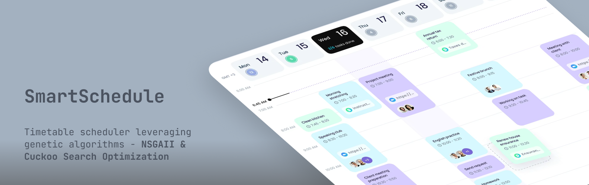

# SmartSchedule

This project is a class scheduler based on genetic algorithms, specifically the NSGA-II (Non-dominated Sorting Genetic Algorithm II) with Cuckoo Search Optimization & Simulated Annealing. It aims to solve the complex problem of creating optimal university class schedules by considering various constraints and objectives.



## Features

- **Genetic Inspired Constraint Satisfaction**: Provides implementation of (1) **Non-Dominated Genetic Search Algorithm (NSGAII) with Cuckoo Search Optimization** & (2) **Simulated Annealing**
- **Multi-objective Optimization**: Uses Genetic Algorithms to handle multiple, often conflicting, objectives such as minimizing professor conflicts, respecting room capacities, and accommodating student group preferences.
- **JSON Configuration**: Class schedules, professor details, room information, and other constraints are defined in a flexible `Input.json` file.
- **Intriguing UI**: Generates a clear and easy-to-read Streamlit UI of the final, optimized schedule.
- **Extensible**: The modular design allows for the addition of new constraints and objectives.

## How to Run

1.  **Prerequisites**: Make sure you have Python 3 and `pip` installed.

2.  **Install Dependencies**:
    ```bash
    python3 -m venv venv
    source venv/bin/activate
    pip install -r requirements.txt
    ```

3.  **Run the Scheduler**:
    ```bash
    streamlit run app.py
    ```
    This will use the default `Input.json` file.


## Input File Format

The `Input.json` file contains an array of objects, each representing a professor, course, room, student group, or class. Here's a brief overview:

-   **`prof`**: Defines a professor with an `id` and `name`.
-   **`course`**: Defines a course with an `id` and `name`.
-   **`room`**: Defines a room with a `name`, `lab` (boolean), and `size`.
-   **`group`**: Defines a student group with an `id`, `name`, and `size`.
-   **`class`**: Defines a class to be scheduled, linking a `professor`, `course`, and `groups`. It also specifies the `duration` and whether it's a `lab` session.

## Author
- Github - [vansh2308](https://github.com/vansh2308)
- Website - [Vansh Agarwal](https://portfolio-website-self-xi.vercel.app/)


